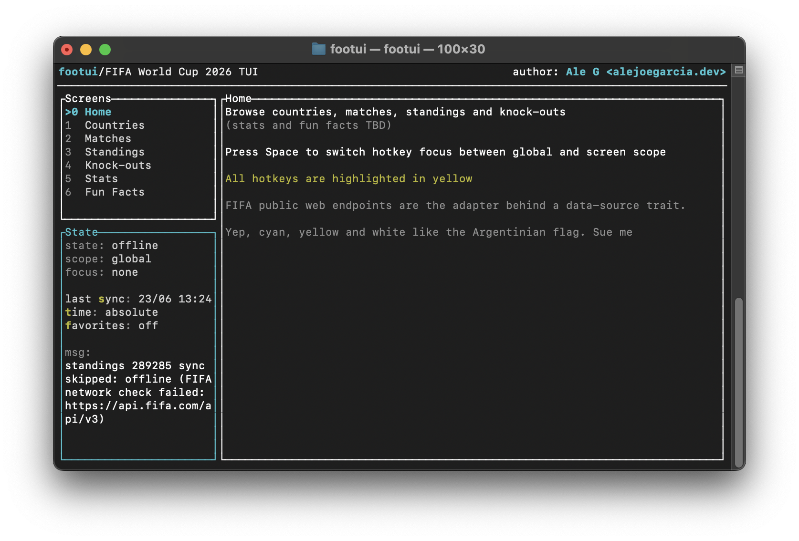
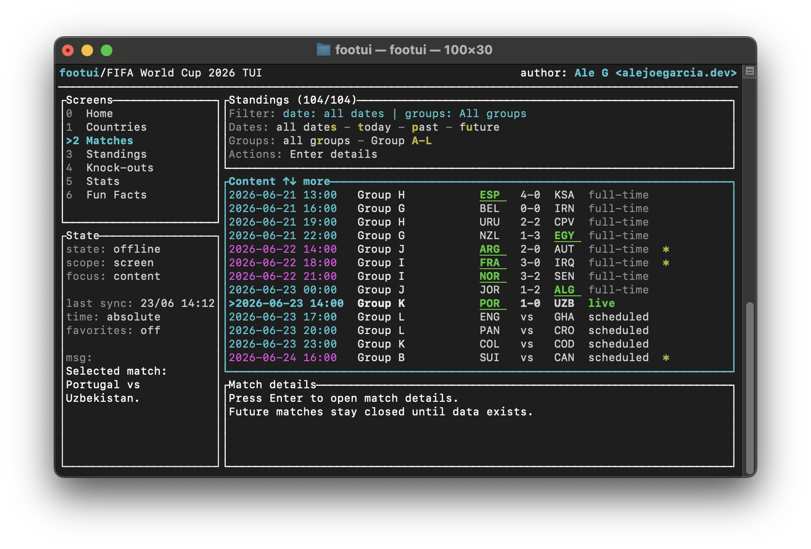
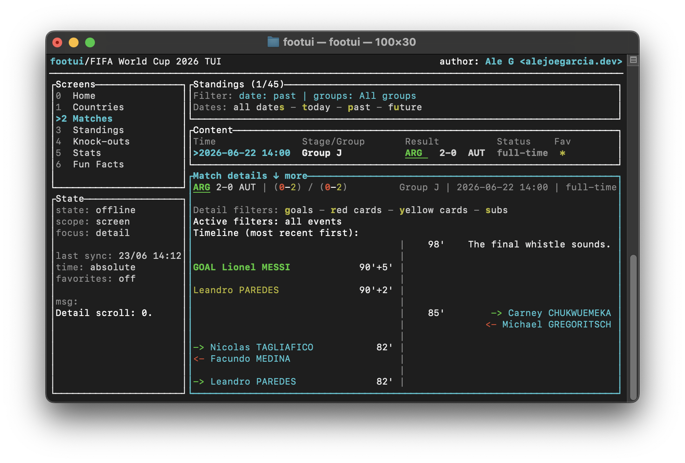
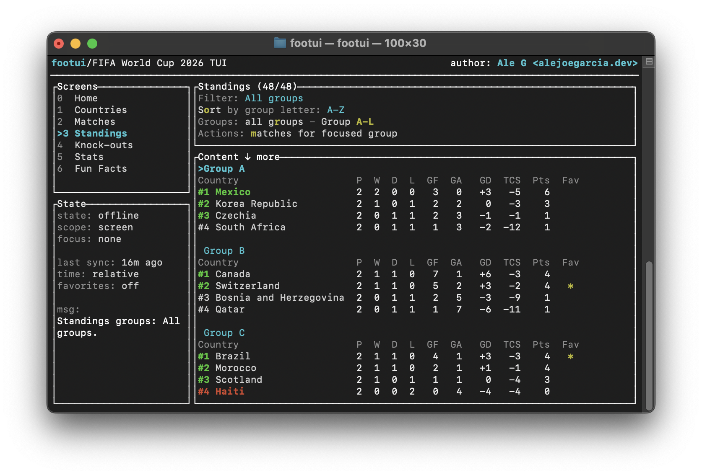
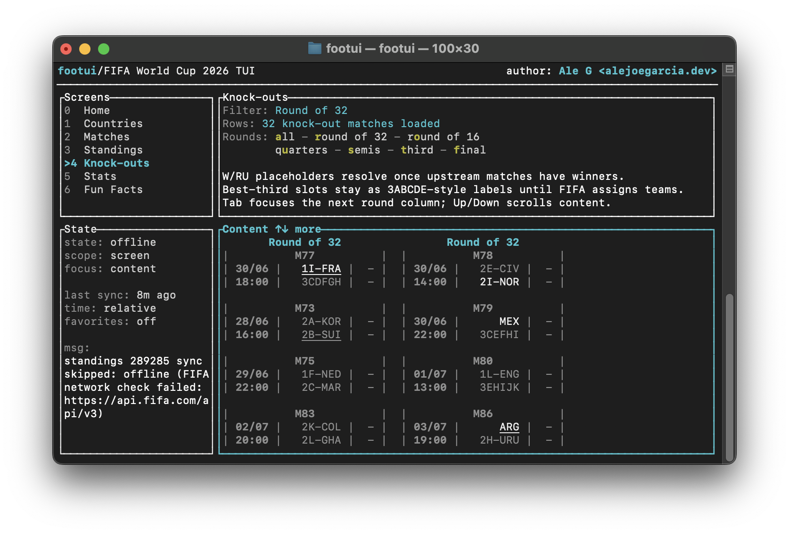

# footui
A Rust-based TUI for browsing FIFA World Cup 2026's data

All data used is publicly available. No cookies / tracking / privacy invasion of any kind. Made for fun

## Recommendations
- run in a 100x30 terminal (images below will match)

## General
- `>{cyan text}` indicates element focus
- `(shift)tab` focuses panels
- hotkeys are highlighted in yellow (if scope allows it, otherwise grayed out)
- use the `Space` key to switch between global and screen scope, and use screen-specific hotkeys
- use the `Enter` key to access details where available
- use the `Esc` key to exit / go back where available
- use the `h` key to see the help
- use the `q` key to quit

## State pane
Always-on pane to see the status of the app + some global hotkeys

## Screens
Always-on pane for quick navigation between screens
- 0-4 are self-describing
- 5-6 haven't been implemented yet

## How to run
Assuming you have Rust installed, you just need `cargo run`. This will install all the dependencies, compile and start (using a local SQLite for persistence)

If you want a more optimized version, `cargo build --release` will compile a release-grade binary. If you don't specify a name (`cargo release your_name`), the binary will be called `footui` and you'll find it in {pwd}/target/release. You can then alias `footui=cd {pwd}/target/release/ && {binary_name}` in your terminal for quicker access
> note: dev and release use different DBs, so don't panic if you i.e don't see your favorites the first time you open the release version

## Demo
### Home
Some intro text

  

---

### Matches
Past (most recent shown first), upcoming, future

  

---

### Match details
Score, cards, and filterable timeline with relevant events

  

---

### Standings
Already qualified teams shown in green, potentially qualified teams' ranking shown in green, disqualified teams shown in red

  

---

### Knock-outs
Column-based filterable view of current KO status (confirmed spots in white, to-be-confirmed spots shown in white with their group and rank, best third places shown in gray with group names only)

  

## AI disclosure
I leveraged AI agents to explore the public data, model the domain and write most of the code. The purpose of this project is merely educational
